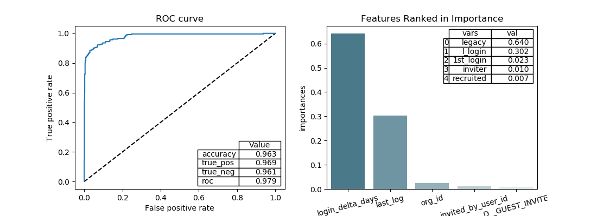

# Finding Key Features - Relax Data

As described, the problem has two files which must be merged and sorted to find the most important indicators of a customer adopting the ap.  The attached notebook shows the steps of cleaning the data by creating categorical variables for email domain and one hot encoding of all categorical variables.  Time delta variables which relate the length of time from account creation to last activity were developed.

After analysis which included correlation analysis and simple classification development (Random Forrest and MPL) it was clear that the derived time delta features were by far the most important.  In fact, they are so effective, that the accuracy (measured by a 5 fold cross validation methodology) was 97.3%.  This result matches intuition, as it makes sense that if a user has had an account for some time and is still logging in, they are happy with the service.


```python

```


```python

```
